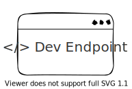

Integrate Mock API Capacity with Vite
## Packages

Package Name | Version | Test | Release
:--: | :--: | :--: | :--:
[endpoint-file-server](./packages/endpoint-file-server/) |  |  | 
[vite-plugin-dev-endpoint](/./packages/vite-plugin-dev-endpoint/) |  |  | 

