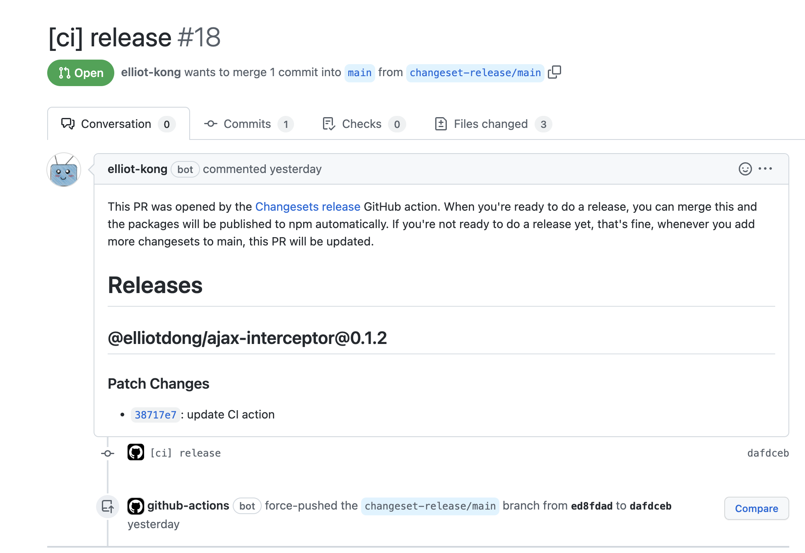
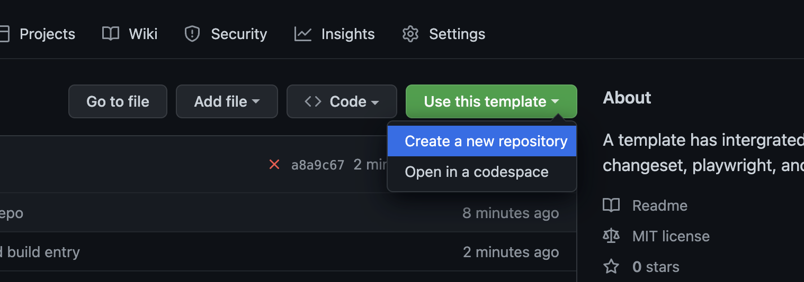
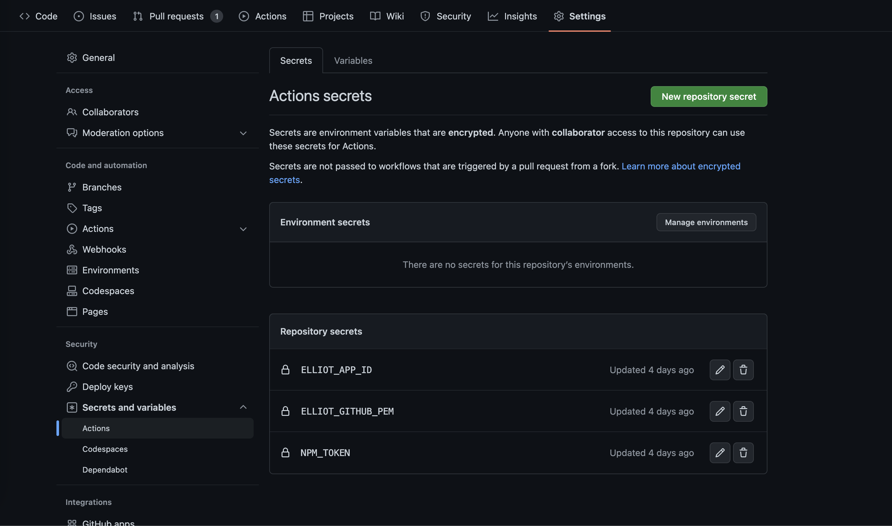

# Template

A template has integrated with [🦋changesets](https://github.com/changesets/changesets), playwright and auto npm publish. You can use it for your npm package.

## What would it looks like.

For example, you create a new branch, make some changes, pull merge request in this new branch, and merge this new brach to main in end.

```
git checkout -b fix-xxx

git add .
git commit -m "fix: xxx"

pnpm exec changeset
git add .
git commit --amend

git push
```

You will see a bot pull a release request like below. You can continue to merge new branches. The bot will automatically update this pr. You can merge this pr to release new version when you want.




## How to use this Template

This template uses a github bot to support `changesets` pull request. So we need to create a private Github APP to use it.

0. Create a Repo from this template

### Create Private Github APP

1. Create a Github APP according to visit [https://github.com/settings/apps](https://github.com/settings/apps).
2. Click `New Github App` button
3. Fill the input boxes of `GitHub App name`, `Homepage URL` with what you want.
4. Inactive Webhook(Of course, you can active it if you want)
5. Activate the `Repository permissions` as below table.

Name | Access
:--: | :--:
Contents | Read and write
Metadata| Read-only
Pull requests | Read and write

### Config Github Action Secrets

6. config action secrets as below pic. `ELLIOT_APP_ID` and `ELLIOT_GITHUB_PEM` you can find from the github app that you have created. `NPM_TOKEN` is a npm token for publish the npm package.

